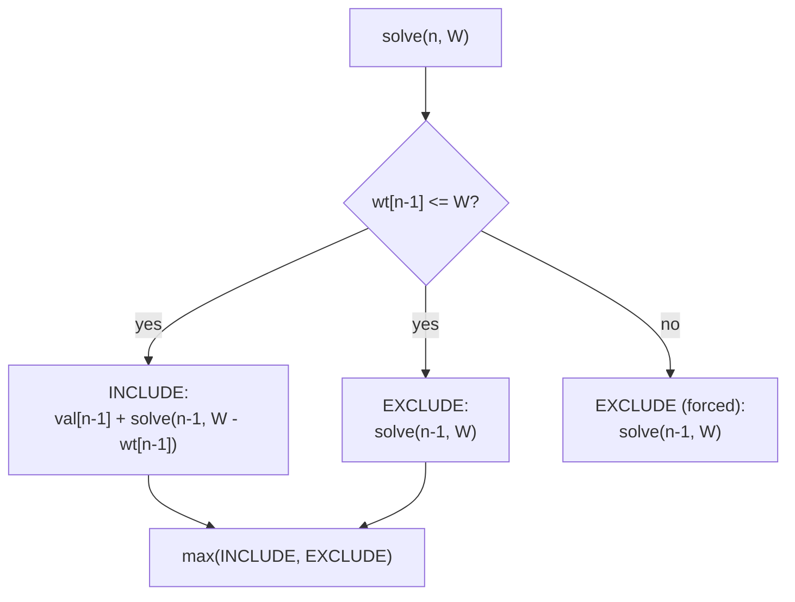

# 00 — Classic 0-1 Knapsack (The Primer)

> Every 0-1 knapsack variation in this folder reduces to **this** recursion. Learn it
> once; reuse it forever.

## Problem

Given `n` items with `val[]` and `wt[]`, and a knapsack of capacity `W`, maximize the
total value of items placed in the knapsack. **Each item may be used at most once
(0 or 1 times).**

## How to Identify

- You repeatedly decide **include this item or not** ("0 or 1").
- You optimize (max value) against a **capacity** constraint.
- The same `(index, remainingCapacity)` state recurs → overlapping subproblems.

## The Choice Diagram



## Recurrence

```
solve(n, W):
    if (n == 0 || W == 0) return 0                      # base: no items or no space
    if (wt[n-1] <= W)
        return max( val[n-1] + solve(n-1, W - wt[n-1]), # include
                               solve(n-1, W) )          # exclude
    else
        return solve(n-1, W)                            # can't include
```

## Tabulation Table (dp[i][w])

Items {(wt2,val3),(wt3,val4),(wt1,val5)}, W = 3:

```
        w=0  w=1  w=2  w=3
i=0      0    0    0    0     <- 0 items
i=1      0    0    3    3     <- item1 (wt2,val3)
i=2      0    0    3    4     <- + item2 (wt3,val4)
i=3      0    5    5    8     <- + item3 (wt1,val5)  answer = dp[3][3] = 8
```

## Complexity

| Approach | Time | Space |
|----------|------|-------|
| Recursive | O(2ⁿ) | O(n) stack |
| Memoized | O(n·W) | O(n·W) + O(n) stack |
| Tabulation | O(n·W) | O(n·W) → O(W) rolled |

See [`Example1_ClassicKnapsack/Solution.java`](Example1_ClassicKnapsack/Solution.java)
for all three approaches with a dry-run trace.
