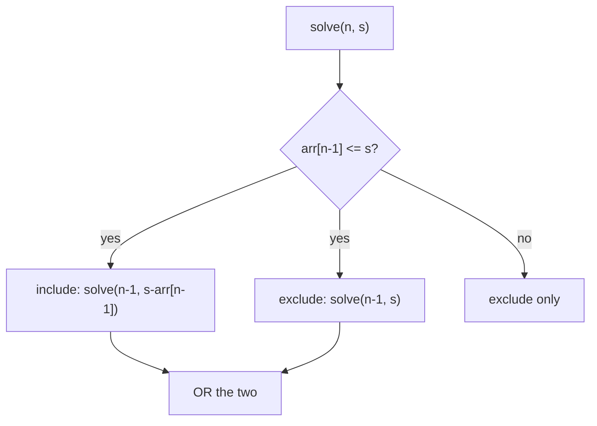

# 01 — Subset Sum

## Problem
Given an array of non-negative integers and a target `sum`, determine whether **any
subset** adds up exactly to `sum`. Answer is boolean.

## How to Identify
- Include/exclude each element (0/1) — a knapsack choice.
- Constraint is a **target sum** (the "capacity") instead of value maximization.
- Feasibility question ("is it possible") → boolean DP.
- This is 0-1 knapsack where **weight == value == the number itself** and we ask
  "can we exactly fill capacity = sum?"

## Recurrence
```
solve(n, s):
    if (s == 0) return true          # empty subset hits 0
    if (n == 0) return false         # no items but s>0
    if (arr[n-1] <= s)
        return solve(n-1, s - arr[n-1])   # include
            || solve(n-1, s)              # exclude
    return solve(n-1, s)
```



## Tabulation Table (dp[i][s], arr={2,3,7,8,10}, target=11)
```
dp[i][s] = dp[i-1][s]  OR  (s>=arr[i-1] && dp[i-1][s-arr[i-1]])
first column (s=0) = true everywhere; first row (i=0, s>0) = false.
```

## Complexity
| Approach | Time | Space |
|----------|------|-------|
| Recursive | O(2ⁿ) | O(n) |
| Memoized | O(n·sum) | O(n·sum) |
| Tabulation | O(n·sum) | O(n·sum) → O(sum) rolled |

Examples: exact subset-sum feasibility, "can partition into a group of size k with sum
S", and a resource-allocation feasibility check.
