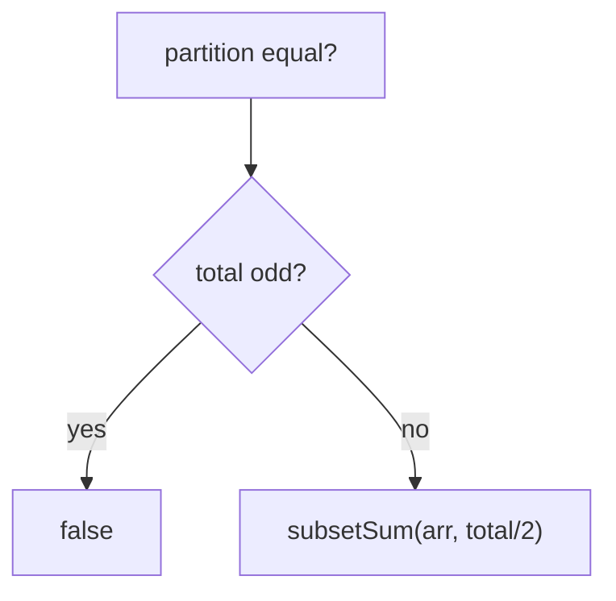

# 02 — Equal Sum Partition

## Problem
Can the array be split into **two subsets with equal sum**?

## How to Identify
- Direct reduction to **Subset Sum**: two equal halves each sum to `total/2`.
- If `total` is odd → impossible immediately.
- So: "can a subset sum to `total/2`?" → boolean 0-1 knapsack.

## Reduction
```
total = sum(arr)
if (total is odd) return false
return subsetSum(arr, total / 2)
```



## Complexity
O(n·total) time, O(total) space (rolled). Same table as Subset Sum with
`target = total/2`.

Examples: classic partition, partition with an odd-total rejection, and "fair team
split" framing.
