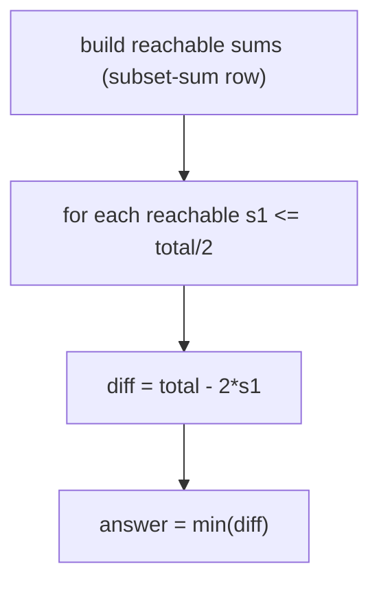

# 04 — Minimum Subset Sum Difference

## Problem
Partition the array into two subsets S1, S2 to **minimize |sum(S1) − sum(S2)|**.

## How to Identify
- Partition into two groups + minimize the gap → optimization built on Subset Sum.
- Key insight: if one subset sums to `s1`, the other is `total − s1`, so the
  difference is `|total − 2·s1|`. Minimize over all **achievable** `s1`.

## Approach
1. Compute all achievable subset sums up to `total/2` (Subset Sum table — the last
   row `dp[n][*]`).
2. For every achievable `s1 ≤ total/2`, candidate diff = `total − 2·s1`.
3. Return the minimum.

## Complexity
O(n·total) time, O(total) space.

Examples: classic min-diff, min-diff with the reachable-set walk, and "balance two
trucks' loads".
