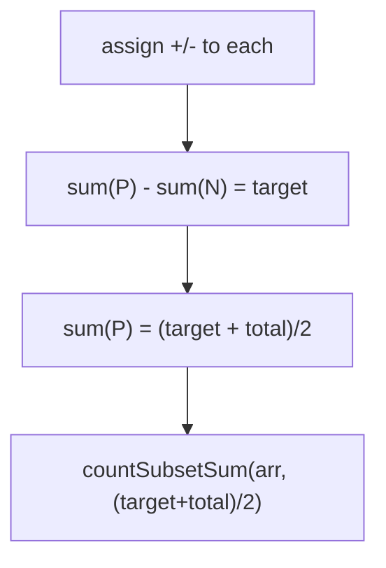

# 05 — Target Sum

## Problem
Assign a `+` or `−` sign to each number so the signed total equals `target`. **Count**
the number of sign-assignments that work.

## How to Identify
- Every element gets one of two signs → an include/exclude decision in disguise.
- Reduces to **Count of Subset Sum**:
  - Let `P` = elements assigned `+`, `N` = elements assigned `−`.
  - `sum(P) − sum(N) = target` and `sum(P) + sum(N) = total`.
  - ⇒ `sum(P) = (target + total) / 2`.
- So: **count subsets summing to `(target + total)/2`**.

## Edge Cases
- If `(target + total)` is **odd** or `target > total` → **0 ways**.
- Zeros in the array multiply the count (each zero can take either sign).

## Complexity
O(n·total) time, O(total) space.

Examples: LeetCode-style target sum, sign-assignment count, and impossible-target
rejection.
